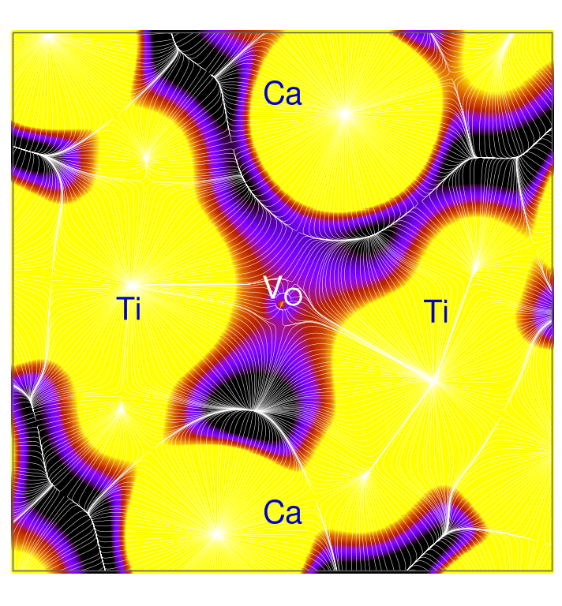

### Vacancia de oxígeno como atractor no nuclear en CaTiO3
M. en C. Marcos Rivera-Almazo   
Asesor: Prof. Jorge Garza Olguín

Contacto: mralm@xanum.uam.mx

||||
|--|--|--|
||||

### Versión interactiva

 
https://molecular-mar.github.io/DES2023

## Contenido

* ### Fundamentos de QTAIM
* ### CaTiO3 con VO
* ### Metodología
* ### Resultados
* ### Conclusiones

---

### Fundamentos de QTAIM

* Teoría Cuántica de Átomos en Moléculas: describir la estructura atómica de un sistema (finito o periódico). 
* Análisis topológico de la densidad electrónica `$\rho(r)$`
Bader, R. F. W. Atoms in Molecules: A Quantum Theory; Oxford University Press: Oxford, UK, 1990.

<!-- 
                            -->

                           
        

                           
<iframe src="waterRho.html" height="300px"></iframe>                                                 

* Puntos críticos `$\rightarrow$` interpretación estructural
* Clasificación basada en la matriz Hessiana:

|Firma|Objeto|
|--|--|
|(3,-3)|Atractor *nuclear/no nuclear* (NA/NNA)|
|(3,-1)|Enlace (BCP)|
|(3,+1)|Anillo|
|(3,+3)|Caja|

 

* (# eigenvalores `$\neq$` 0, `$\sum sign$` eigenvalores) 

* Ruta de enlace (BP): Trayectoria `$\nabla \rho$` que une (3,-1) a dos (3,-3). 

* NA + BCP + BP = Grafo molecular

### Ejemplo: interacción Benceno-MOF
<!-- |||
|--|--|
| |<model-viewer bounds="tight" enable-pan src="mfmIn_bpath_New.glb" ar ar-modes="webxr scene-viewer quick-look" camera-controls environment-image="neutral" camera-orbit="0deg 90deg 2m" poster="img/poster.png" shadow-intensity="0" auto-rotate interaction-prompt=none></model-viewer>| -->

        <model-viewer bounds="tight" 
 	        enable-pan src="models3D/mfmIn_bpath_New.glb"
	        camera-controls environment-image="neutral" 
            camera-orbit="-4.9deg 86.11deg 6.512m" field-of-view="25.77deg"
        	poster="img/poster.png" 
        	shadow-intensity="0" auto-rotate
            interaction-prompt=none>
        </model-viewer>
    

Rivera-Almazo, M. et al. Isostructural MFM-300(Sc) and MFM-300(In): Adsorption Behavior to Determine Their Differences. J. Phys. Chem. C 300, (2022).

---

### CaTiO3 con VO

* Grupo espacial `$Pnma$`
* Estudio experimental, dopado con Yb`$^{+3}$`
* Excitación a 2.98 eV   (`$E_g=3.85$`)
* Posible influencia de defectos   (¿V`$_O$`?)

 I. Padilla-Rosales, I. et al. Near infrared photon-downshifting in Yb3+-doped titanates: The influence of intrinsic defects, Journal of Alloys and Compounds 834,
155081 (2020).

 

---

### Metodología

    

* Cálculos *ab initio* usando ***CRYSTAL14***. 
* Optimización completa de geometría.
* Base POB-TZVP. Funcional XC híbrido PBE0-`$\alpha_{adj}$`
* Sistema prístino, celda unitaria típica.
    * PBE0(25) y PBE0-20 ajuste. `$\alpha_{adj}$=17.33`
    * Muestreo puntos k Monkhorst-Pack 12x12x12 
 
Dovesi, R. et al. CRYSTAL14 : A program for the ab initio investigation of crystalline solids. Int. J. Quantum Chem. 114, 1287–1317 (2014). 

    

* Sistema con V`$_O$`:
    * Supercelda 16 unidades formula`$\rightarrow$` CaTiO`$_{2.937}$`-vO`$_{0.063}$`
    * Dos átomos no equivalentes (**O`$_{ap}$`** y O`$_{eq}$`)
    * Muestreo puntos k Monkhorst-Pack 3x3x3
    * Estado triplete (`$n_\alpha-n\beta=2$`)

Maul, J. et al. A quantum-mechanical investigation of oxygen vacancies and copper doping in the orthorhombic CaSnO3 perovskite. Phys. Chem. Chem. Phys. 20, 20970–20980 (2018).

    

* Análisis de `$\rho(r)$`
    * TOPOND (CRYSTAL14)
    * Módulo Cube3D de GPUAM

Hernández-Esparza, R. et al. GPUs as Boosters to Analyze Scalar and Vector Fields in Quantum Chemistry. Int. J. Quantum Chem., 119,1−9 (2019).

---

### Resultados

* Diferencia triplete-singulete: \[0.05-0.08\] eV (triplete más estable)
* Aumento en el volumen respecto a pristino: \[0.1-0.3\]\%
* Resultados para V`$_O^{ap}$` triplete.

 

#### Bandas/DOS

* Aparición de estados `$\alpha$`. 
 

#### Valores de Gaps

|Modelo | `$E_g^{dir}$` | `$E_g^{ind}$` | `$E_g'$` |  `$E_g''$`|
|--|--|--|--|--|
| V`$_O^{ap}$` singulete | 0.57 | 0.49 | 3.37 | -|
| V`$_O^{ap}$` triplete | 0.67 | 0.53 | 2.82 | 0.46|
| V`$_O^{eq}$` singulete | 0.60 | 0.51 | 3.36 |-|
| V`$_O^{eq}$` triplete | 0.60 | 0.44 | 2.80 |0.50|

* `$E_g'$` es cercano al valor observado para la excitación de Yb`$^{+3}$` en CaTiO`$_3$`

#### Densidad electrónica

* Densidad electrónica en plano Ti-V`$_O$`-Ti
* Pristino (izq.) y V`$_O$` (der).

 

* Diferencia clara en la forma de los Ti.

 
  
 
* Planos Ti-V`$_O$`-Ti (izq.)  y Ca-V`$_O$`-Ca (der.).
* Observamos una región *anillo*, seguida de la región del atractor.

 
 

* Planos Ti-V`$_O$`-Ti (izq.)  y Ca-V`$_O$`-Ca (der.).
* Observamos una región *anillo*, seguida de la región del atractor.

 
 

* `$\nabla^2 \rho$`. Pristino (izq.) y V`$_O$` en plano Ti-V`$_O$`-Ti (der.) 
* Aparición de una capa donde se concentra `$\rho$`.

 
 

* `$\nabla^2 \rho$`. Plano Ti-V`$_O$`-Ti (izq.) y Ca-V`$_O$`-Ca (der.)

|Modelo | `$\rho_{crit}$` | `$\nabla^2 \rho_{crit}$` | q (Mulliken)|
|--|--|--|--|
|V`$_O^{ap}$` singulete | 0.032 | -119.47 | 0.89 |
|V`$_O^{ap}$` triplete | 0.021 | -69.71 | 0.69 (0.54 `$\alpha$`) |
|V`$_O^{eq}$` singulete | 0.031 | -118.01 | 0.89 |
|V`$_O^{eq}$` triplete | 0.021 | -69.42 | 0.68 (0.54 `$\alpha$`)|

### Rutas de enlace

 

* Rutas de enlace Ti-Ti y Ti-Ca, influenciadas por V`$_O$`.

* Propiedades de los CP:

|BCP|`$\rho_{crit}$`|`$\nabla^2 \rho_{crit}$`| `$\epsilon$` |
|--|--|--|--|
|Ti-Ti| 0.0145| -0.0180| 4.0908|
|Ti-Ca| 0.0115| 0.0032| 1.7748|

* `$\epsilon = \lambda_1 / \lambda_2 - 1 $`. Desviación de la distribución circular de `$\rho$` en plano perpendicular al BP. 

---

<!-- 

    

> Periodic *ab initio* calculations were performed, using the code ***Crystal***, looking up for differences between each system alone and with a Bz molecule. 

    
    
    

|||
|--|--|
|MFM-300(Sc)|MFM-300(In)|

What we found:
    
    
    

|||
|--|--|
| ||

* Electronic density differences between the bulk system and a reference isolated atoms model show differences in the distribution of the electronic density, primarily around the oxygen from μ2-OH

    
    
    

    
    
|||
|--|--|
| ||
        
* NCI analysis shows different nature of non-covalent interactions around a M-O(H)-M-O-C-O ring, which could indicate a higher strain for the In system.
    
    
    

|||
|--|--|
| ||

* AIM study with Bz shows that in the In system the Bz molecule has an additional interaction with a second μ2-OH
    
    
    

|||
|--|--|
| ||

* Void analysis shows posible second Bz adsorption sites. μ2-OHs in the In system are less directed to the pore, therefore less available for new interactions.
    

-->

---

### Conclusiones

* La inclusión de V`$_O$` conlleva la aparición de estados. El Gap Valencia-Estado V`$_O$` es cercano con el encontrado para CaTiO`$^3$` + Yb`$^{+3}$`.
* En el sitio de V`$_O$` aparece un NNA, afectando el comportamiento general de `$\rho(r)$` en dicha vecindad. Este cambio lo asociamos a la aparición de las bandas adicionales.
* El comportamiento de `$\rho$` alrededor de V`$_O$`, con un *anillo* de densidad alrededor del atractor, no parece estar previamente reportado.
* Obtenemos una interacción Ti-Ti, además de una interacción Ti-Ca. No encontramos interacciones con V`$_O$`.
<!-- Given a [proposed](https://pubs.acs.org/doi/10.1021/acs.chemmater.1c01918) reaction mechanism, this may explain the formation of larger polysulfides.  -->

---
<!-- ### Published [article](https://pubs.acs.org/doi/10.1021/acs.jpcc.2c00742):   -->
<!-- Rivera-Almazo, Marcos, *et al*, Isostructural MFM-300(Sc) and MFM-300(In):   -->
<!-- Adsorption Behavior to Determine Their Differences, The Journal of Physical   -->
<!-- Chemistry C **2022** 126 (14), 6465-6471 -->

<!--   -->

## Gracias por su atención

QR a esta presentación:

