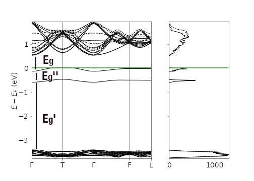

### Vacancia de oxígeno como atractor no nuclear en CaTiO3
M. en C. Marcos Rivera-Almazo  

Contacto: mralm@xanum.uam.mx

||||
|--|--|--|
||||

### Contenido

* Fundamentos de QTAIM
    * Algunos ejemplos
* CaTiO3 con VO
* VO como NNA

---

### Fundamentos de QTAIM

* Teoría Cuántica de Átomos en Moléculas: describir la estructura atómica de un sistema (finito o periódico). 
* Análisis topológico de la densidad electrónica `$\rho(r)$`

<!-- 
                            -->

                           
        

                           
<iframe src="waterRho.html" width="100%" height="500px"></iframe>                                                 

* Puntos críticos `$\rightarrow$` interpretación estructural
* Clasificación basada en la matriz Hessiana:

|Firma|Objeto|
|--|--|
|(3,-3)|Atractor *nuclear/no nuclear* (NA/NNA)|
|(3,-1)|Enlace (BCP)|
|(3,+1)|Anillo|
|(3,+1)|Caja|

 

* (# eigenvalores `$\neq$` 0, `$\sum sign$` eigenvalores) 

* Ruta de enlace (BP): Trayectoria `$\nabla \rho$` que une (3,-1) a dos (3,-3). 

* NA + BCP + BP = Gráfo molecular

### Caso de uso: interacción Benceno-MOF
<!-- |||
|--|--|
| |<model-viewer bounds="tight" enable-pan src="mfmIn_bpath_New.glb" ar ar-modes="webxr scene-viewer quick-look" camera-controls environment-image="neutral" camera-orbit="0deg 90deg 2m" poster="img/poster.png" shadow-intensity="0" auto-rotate interaction-prompt=none></model-viewer>| -->

        <model-viewer bounds="tight" 
 	        enable-pan src="mfmIn_bpath_New.glb"
	        camera-controls environment-image="neutral" 
            camera-orbit="-158.9deg 86.11deg 8.012m" field-of-view="25.77deg"
        	poster="img/poster.png" 
        	shadow-intensity="0" auto-rotate
            interaction-prompt=none>
        </model-viewer>
    

---

### CaTiO3 con VO

* Grupo espacial `$Pnma$`
* Estudio experimental, dopado con Yb`$^{+3}$`
* Excitación a 2.98 eV  \(`$E_g=3.85$`)
* Posible influencia de defectos  \(¿`$V_O$`?)

 

---

### Metodología

* Cálculos *ab initio* usando ***CRYSTAL14***. 
* Optimización completa de geometría. Bandas, DOS, `$\rho(r)$`.
* Base POB-TZVP. Funcional XC híbrido PBE0-`$\alpha_{adj}$`
* Sistema prístino, celda unitaria típica.
    * PBE0 y PBE0-20 para `$\alpha_{adj}$`. `$\alpha_{adj}$=17.33`
    * Muestreo puntos k Monkhorst-Pack 12x12x12 
* Sistema con `$V_O$`:
    * Supercelda 16 unidades formula`$\rightarrow$` CaTiO`$_{2.937}$`-vO`$_{0.063}$`
    * Dos átomos no equivalentes (O`$_{ap}$` y O`$_{eq}$`)
    * Muestreo puntos k Monkhorst-Pack 3x3x3
    * Estado triplete

---

### Resultados

* Diferencia triplete-singulete: 
    * Energía: \[0.05-0.08\] eV (triplete más estable)
* Aumento en el volumen respecto a pristino: \[0.1-0.3\]\%

 

|Modelo | `$E_g^{dir}$` | `$E_g^{ind}$` | `$E_g'$` |  `$E_g''$`|
|--|--|--|--|--|
| V`$_O^{ap}$` singulete | 0.57 | 0.49 | 3.37 | -\\
| V`$_O^{ap}$` triplete | 0.67 | 0.53 | 2.82 | 0.46\\
| V`$_O^{eq}$` singulete | 0.60 | 0.51 | 3.36 |-\\
| V`$_O^{eq}$` triplete | 0.60 | 0.44 | 2.80 |0.50\\

 

* Densidad electrónica en plano Ti-V`$_O$`-Ti
 
 

* Laplaciano de la densidad
 

|Modelo | Densidad | Laplaciano|
|--|--|--|
|V`$_O^{ap}$` singulete | 0.032 | -119.47 |
|V`$_O^{ap}$` triplete | 0.021 | -69.71 |
|V`$_O^{eq}$` singulete | 0.031 | -118.01 |
|V`$_O^{eq}$` triplete | 0.021 | -69.42 |

<!-- 

    

> Periodic *ab initio* calculations were performed, using the code ***Crystal***, looking up for differences between each system alone and with a Bz molecule. 

    
    
    

|||
|--|--|
|MFM-300(Sc)|MFM-300(In)|

What we found:
    
    
    

|||
|--|--|
| ||

* Electronic density differences between the bulk system and a reference isolated atoms model show differences in the distribution of the electronic density, primarily around the oxygen from μ2-OH

    
    
    

    
    
|||
|--|--|
| ||
        
* NCI analysis shows different nature of non-covalent interactions around a M-O(H)-M-O-C-O ring, which could indicate a higher strain for the In system.
    
    
    

|||
|--|--|
| ||

* AIM study with Bz shows that in the In system the Bz molecule has an additional interaction with a second μ2-OH
    
    
    

|||
|--|--|
| ||

* Void analysis shows posible second Bz adsorption sites. μ2-OHs in the In system are less directed to the pore, therefore less available for new interactions.
    

---

### Conclusions

* MFM-300(Sc) has a tighter structure, given the non-covalent interactions predicted. More ordered material. 
* MFM-300(In) OH groups tend to modify its direction on the influence of an adsorbed Bz. 
* Because of that it has a lower adsorption capacity. 
* Given a [proposed](https://pubs.acs.org/doi/10.1021/acs.chemmater.1c01918) reaction mechanism, this may explain the formation of larger polysulfides. 

---
### Published [article](https://pubs.acs.org/doi/10.1021/acs.jpcc.2c00742):  
Rivera-Almazo, Marcos, *et al*, Isostructural MFM-300(Sc) and MFM-300(In):  
Adsorption Behavior to Determine Their Differences, The Journal of Physical  
Chemistry C **2022** 126 (14), 6465-6471

 -->

## Gracias por su atención

QR a esta presentación:

